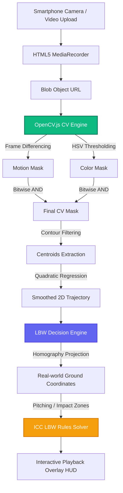

# 🏏 Pocket-DRS

[](https://pocket-drs.vercel.app)
[](https://nextjs.org)
[](https://tailwindcss.com)
[](https://docs.opencv.org)
[](https://fastapi.tiangolo.com)

An **offline-first, browser-based cricket analytics platform** designed to deliver a low-cost, professional DRS-style review experience using a single smartphone camera and on-device computer vision. No expensive sensors or radar units required.

---

## ⚡ Core Capabilities

* **📱 Device Orientation Enforcing**: Built-in responsive overlay locks viewport to **landscape mode** to guarantee consistent camera aspect ratios and math precision during pitches.
* **📐 Interactive Pitch Calibration Workspace**: Drag-and-drop workspace supporting high-precision coordinate mapping. Includes a keyboard/button D-pad nudge controller and a floating magnifier loupe so fingers never cover the line.
* **🌀 Client-Side OpenCV.js Engine**: Performs absolute difference frame differencing, color-space HSV thresholding, circular contour filtering, and quadratic regression curves for path smoothing directly inside your browser.
* **🎥 Rich Playback Controls**: Interactive seek bar stepping frame-by-frame with precise snap alignment, 5-navigation control buttons, and dynamic keyboard shortcuts.
* **⚖️ Custom LBW Rules Engine**: Translates 2D canvas trajectory pixels to real-world ground meters using homography projection matrices. Automates official ICC LBW rules processing with toggles for batsman handedness and stroke offering.
* **💾 Local Persistence**: Instant profile reload on client initialization from browser `localStorage`, eliminating loading lag or hydration flashes.

## 🏗️ System Architecture

Pocket-DRS is engineered as an offline-first, client-driven platform that offloads real-time computer vision processing to the browser to ensure zero latency and minimal backend dependencies.



### Key Architectural Pillars

#### 📴 1. Offline-First & Client-Driven
To enable seamless field usage under unpredictable network conditions, all compute-heavy operations are executed locally:
* **Camera Access & Capture**: Managed through standard browser HTML5 `MediaDevices` and recorded via `MediaRecorder` APIs.
* **Computer Vision**: Frame parsing, grayscaling, thresholding, and contour filtering are powered on-device by **OpenCV.js** compiled to WebAssembly.
* **State Persistence**: Calibration matrix formulas and system presets are instantly stored and reloaded from browser `localStorage`.

#### 🧬 2. Hybrid Computing Model (Next.js + FastAPI)
Responsibilities are clearly decoupled to maintain high rendering framerates and minimize hosting overhead:
* **Client-Side (Next.js)**: Runs all frame-by-frame image operations, coordinate matrix transformations, interactive UX elements, and SVG/Canvas canvas annotations at 60 FPS.
* **Analytical Backend (FastAPI)**: Serves as an asynchronous decision-support engine, handling future long-term storage, bowling statistics, and cross-session historical telemetry.

#### 🔒 3. Zero-Trust Media Policy
User privacy and network bandwidth are protected by separating media from telemetry:
* Raw video recordings are kept **strictly in-memory** as temporary object URLs and are never transmitted to any external server.
* The optional backend service only receives lightweight, structured JSON metadata (e.g. bounce coordinates, batsman impact coordinates, velocities, and decision parameters) rather than large binary video files.

---

## 📂 Repository Structure

```text
PocketDRS/
├── frontend/                  # Next.js, Tailwind CSS & TypeScript app
│   ├── src/
│   │   ├── app/               # App Router pages (Home, layout, manifest)
│   │   ├── components/        # CameraFeed, CalibrationWorkspace, PlaybackPlayer, ARAlignment
│   │   ├── core/              # Shared geometry math, tracking loop, and LBW rules solver
│   │   │   ├── geometry/      # Homography matrices and coordinate projection
│   │   │   ├── lbw/           # ICC pitching, impact, and stumps hit checkers
│   │   │   └── tracking/      # OpenCV.js frame processor
│   │   └── hooks/             # useOpenCV, useCalibration, useBallTracker wrappers
│   └── package.json
└── backend/                   # FastAPI Python app (Railway ready)
    ├── app/                   # API entry point & routers
    ├── Dockerfile             # Container configuration for cloud hosting
    └── requirements.txt       # Python dependencies
```

---

## 🛠️ Local Development Setup

### Prerequisites
* **Node.js**: `v18+`
* **Python**: `v3.10+`

### 1. Launching the Frontend

Navigate into the frontend directory, install npm packages, and spin up the developer server:
```bash
cd frontend
npm install
npm run dev
```
Open [http://localhost:3000](http://localhost:3000) in your web browser. 

> [!TIP]
> Ensure you grant camera permissions to your browser if prompts appear. If local HTTPS loopbacks are required on mobile, expose the port using `ngrok` or similar tunnels.

### 2. Launching the Backend

Navigate into the backend directory, initialize a python virtual environment, install dependencies, and run the FastAPI server:
```bash
cd backend
python -m venv venv

# Activate Virtual Env
# On macOS/Linux:
source venv/bin/activate
# On Windows (PowerShell):
.\venv\Scripts\Activate.ps1

pip install -r requirements.txt
uvicorn app.main:app --reload --host 0.0.0.0 --port 8000
```
The interactive Swagger API documentation will be available at [http://localhost:8000/docs](http://localhost:8000/docs).

---

## 🗺️ Project Roadmap

- [x] **Version 0 (MVP)**: Client-side mobile camera capture, on-device recording playback, OpenCV.js-based manual pitch & wicket calibration, persistent overlays, and gyroscope level alignment.
- [x] **Version 1**: Client-side ball detection, HSV chroma thresholding, motion differencing, and trajectory curve smoothing.
- [x] **Version 2**: Multi-phase LBW rules calculator (pitching line, batsman impact coordinate, stumps path prediction).
- [ ] **Version 3**: Analytical backend endpoints for match history scaling, bowling analytics, line/length heatmaps, and session history dashboard.
- [ ] **Version 4**: DRS 3D-style replay visualization screen.
- [ ] **Future Post-MVP**:
  * Custom HSV threshold calibration panel.
  * AR-Assisted Calibration (auto-scanning pitch tile boundaries and floor orientation via camera scene understanding).

---

## 📜 Disclaimer
Pocket-DRS is an independent, experimental educational project intended for amateur cricket analysis. It is not affiliated with the International Cricket Council (ICC), Hawk-Eye Innovations, or any professional cricket governing body.
